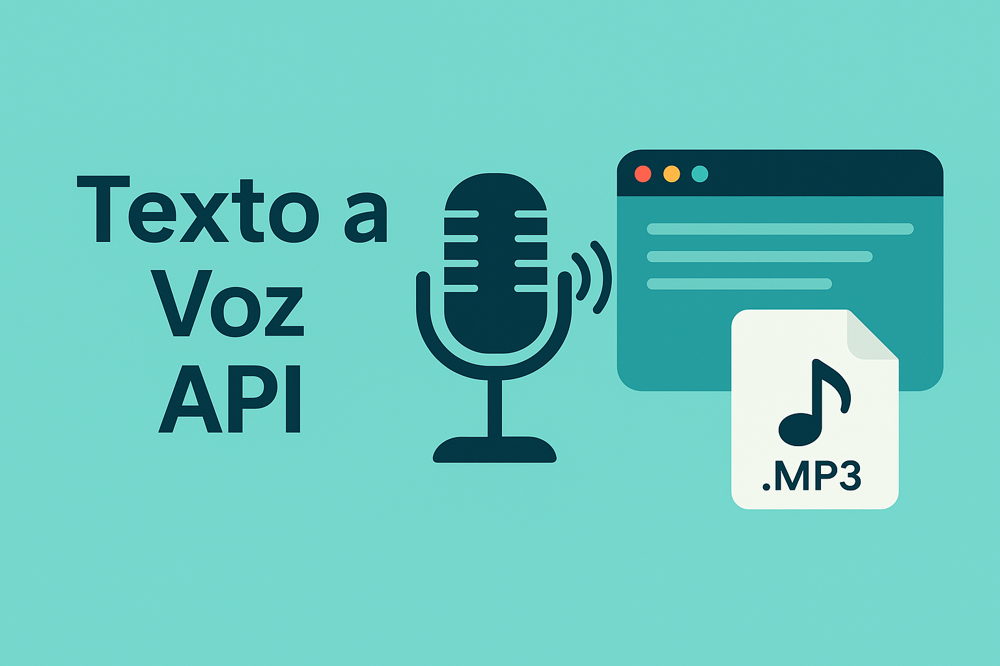

# 🔊 Flask TTS API – Texto a Voz

API RESTful desarrollada con **Flask** y **gTTS** que convierte texto en audio y devuelve un archivo `.mp3`.

---

## 🚀 ¿Qué hace esta API?

- Recibe texto vía `POST` en formato JSON
- Usa `gTTS` (Google Text-to-Speech) para generar un audio `.mp3`
- Devuelve el archivo de audio directamente como respuesta

---

## 🧱 Estructura del proyecto

```
flask-tts-api/
├── app_tts_api.py        ← API principal
├── requirements.txt      ← Dependencias (Flask + gTTS)
├── audios/               ← Carpeta donde se guardan los audios generados
└── README.md             ← Este archivo 📘
```

---

## ⚙️ Instalación

```bash
git clone https://github.com/ben1998pe/flask-tts-api.git
cd flask-tts-api
pip install -r requirements.txt
```

---

## ▶️ Ejecutar la API

```bash
python app_tts_api.py
```

Te mostrará:

```
 * Running on http://127.0.0.1:5000/
```

---

## 📬 Endpoint

### `POST /tts`

**Body (JSON):**

```json
{
  "texto": "Hola, esto es una prueba.",
  "idioma": "es"
}
```

**Respuesta:** archivo `.mp3` descargable 🎧

---

## 🌍 Idiomas compatibles

Puedes enviar el campo `"idioma"` con el código del idioma (por defecto `"es"` para español).

Ejemplos válidos:
- `"es"` → español
- `"en"` → inglés
- `"fr"` → francés

---

## 🧑‍💻 Autor

Desarrollado por [@ben1998pe](https://github.com/ben1998pe) – Proyecto 6: API real para convertir texto en audio.

---

## 📄 Licencia

MIT
